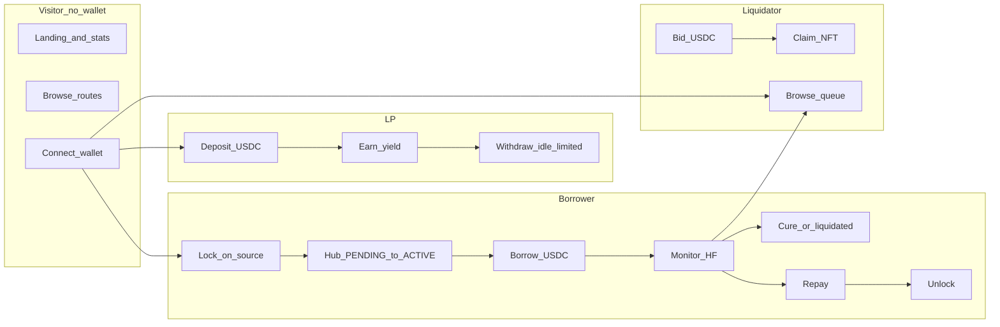

# Slab.Finance — User flows

This document defines end-to-end user journeys for **Borrower**, **Liquidity provider (LP)**, and **Liquidator** roles, including behavior when **no wallet is connected**. It aligns with the protocol design in [WHITEPAPER.md](./WHITEPAPER.md), developer reference in [DOCS.md](./DOCS.md), and UI specs under [specs/](./specs/).

**Authentication model:** There is no email/password sign-in. Access is **wallet-based**: EVM via Reown AppKit + Wagmi (WalletConnect), hub-side activity on **Solana** via Phantom / Solflare (`Web3Provider`). The same person may use multiple wallets or chains in one session depending on the action (source chain for lock vs hub for pool operations).

**Primary routes** (see [`frontend/src/App.tsx`](frontend/src/App.tsx)):

| Path | Purpose |
|------|---------|
| `/` | Dashboard (portfolio, protocol stats, quick actions) |
| `/assets` | Assets / collateral views |
| `/lending` | Lending hub — tabs: `?tab=deposit`, `?tab=borrow`, `?tab=repay` |
| `/borrow` | Standalone borrow |
| `/repay` | Standalone repay + unlock after zero debt |
| `/lock` | Lock NFT on Polygon/Base (EVM adapter + LayerZero) |
| `/liquidations` | Active auctions + history |

---

## 1. Unauthenticated visitor (not connected)

A visitor has **not** completed wallet connect. They can explore the app in a **read-mostly** mode.

### 1.1 Landing on the dashboard (`/`)

- Sees **protocol-level** metrics where wired (TVL, utilization, supply/borrow APR, etc.) from public reads / API when `VITE_API_BASE` is configured.
- **No** personalized portfolio, debt, health factor, or collateral tied to an address until a wallet is connected.
- **Connect** control lives in the header (Reown `AppKitButton`).

### 1.2 Browsing other pages without a wallet

| Page | Typical experience |
|------|---------------------|
| `/assets` | Protocol or catalog context; personal “mine” scope empty or gated behind connect. |
| `/lending` | Tabs for Deposit / Borrow / Repay; actions show **connect wallet** / wrong-chain messaging instead of transaction buttons. |
| `/liquidations` | May list **public** auction queue from indexer/API; bidding still requires connect + USDC on hub. |
| `/lock` | Copy and chain switch UI; primary lock action requires EVM connect on **Polygon** or **Base**. |

### 1.3 Connecting a wallet

1. User taps **Connect** in the header.
2. **EVM:** WalletConnect / injected wallet via AppKit; used heavily for `/lock` and for lending UI paths that still use Wagmi against hub-style contracts.
3. **Solana:** Phantom or Solflare; `ConnectionProvider` targets `protocolConfig.hub.rpcUrl`.
4. After connect, **`PostConnectHubChainSync`** switches the Wagmi chain to the configured **hub placeholder** for consistency — **except** on `/lock`, where the user stays on Polygon/Base to complete `lockAndNotify`.

### 1.4 What an unauthenticated user cannot do

- Sign **borrow**, **repay**, **deposit**, **withdraw**, **lock**, **bid**, or **claim** transactions.
- See **address-scoped** backend data (`/positions/:address`, `/activity/:address`, etc.) for “their” hub identity until that address is known (post-connect or pasted elsewhere if the product adds it).

---

## 2. Borrower flows

Borrowers escrow **tokenized collectible NFTs** (EVM source chains and/or Solana-native per deployment), register collateral on the **Solana hub** (`slab_hub`), draw **USDC**, repay, then recover collateral. Target lifecycle:

```text
LOCK → BORROW → REPAY → UNLOCK
```

On-chain instruction names on the hub include `lock_spl_nft`, `receive_cross_chain_lock`, `borrow`, `repay`, `unlock_spl_nft`, plus `refresh_health` (see [`programs/slab_hub/src/lib.rs`](programs/slab_hub/src/lib.rs)).

### 2.1 Lock collateral (`/lock`)

**Goal:** Move NFT into protocol custody on the **source chain** and register it on the hub.

1. **Connect** EVM wallet; **switch network** to **Polygon** or **Base** (per `protocolConfig.evmSources`).
2. Browse **inventory** of allowed collection token IDs (e.g. `GET /inventory/evm/:chainId/:wallet` when API is available).
3. Optional: view **valuation** (`/cards/:collection/:tokenId/valuation`) for UX / risk copy.
4. **Approve** ERC-721 to the **CollateralAdapterLayerZero** (or flow-specific spender).
5. Call **`lockAndNotify`** — NFT transfers to **`NFTVault`**, adapter sends **LayerZero** `LOCK_NOTICE` toward the Solana hub.
6. Pay **native gas** + **LZ fee**; track delivery on [LayerZero Scan](https://layerzeroscan.com/).
7. Hub records collateral; lifecycle **`PENDING`** until **`oracle_set_price`** marks pricing — then collateral can become **`ACTIVE`** and contribute to borrowing power.

**Solana-native path (when used):** User signs `lock_spl_nft` on hub for whitelisted SPL collections.

### 2.2 Borrow USDC (`/lending?tab=borrow` or `/borrow`)

**Prerequisites:**

- Collateral registered for the borrower’s **hub owner** identity.
- Oracle **non-stale** price and collateral status suitable for **`ACTIVE`** borrowing power.
- Health factor in a zone that **allows new debt** (per product rules: not in **WARNING** / **LIQUIDATABLE** when those gates apply).

**Flow:**

1. Connect **hub** wallet (Solana for production hub); resolve **wrong-chain** prompts if shown.
2. Review **available credit** (aggregate of priced collateral × effective LTV, minus existing debt caps).
3. Enter amount ≤ available credit; optional **health factor preview** before submit.
4. Sign **`borrow(amount)`** on hub; USDC transfers from pool vault to borrower.

### 2.3 Monitor position (`/` dashboard, `/assets`)

- **Collateral** list with status (pending / active / unlock / liquidated per shared enums).
- **Debt:** principal, accrued interest (when accrual engine is live), total outstanding.
- **Health factor (HF):**

  | Zone | Condition (target product) | Behavior |
  |------|----------------------------|----------|
  | Healthy | HF ≥ 1.30 | Normal borrows (within credit). |
  | Warning | 1.00 ≤ HF < 1.30 | New borrows disabled; repay encouraged. |
  | Liquidatable | HF < 1.00 | Auctions queued per active collateral (see §4). |

- **Activity** feed when indexer + API back `GET /activity/:address`.

### 2.4 Repay loan (`/lending?tab=repay` or `/repay`)

1. Connect on **hub** chain.
2. Display **outstanding debt**; allow **partial** or **full** repay (Max = total debt).
3. **Approve** USDC to pool, then sign **`repay(amount)`**.
4. If still in **WARNING** after partial repay, show continued risk copy.

### 2.5 Unlock collateral (after zero debt)

1. When **total debt = 0**, enable **unlock** path: hub verifies no debt, marks collateral for release.
2. **EVM-held NFTs:** Solana sends **unlock** message via LayerZero; adapter **`_lzReceive`** releases NFT from **`NFTVault`** to recipient on **source chain**.
3. Terminal collateral states: **`UNLOCK_SENT` → `RELEASED`** (per [WHITEPAPER.md](./WHITEPAPER.md) §6.1).

Standalone **`/repay`** may surface **`initiateUnlock`** after repayment when wired to the registry / program.

### 2.6 Cure during liquidation (borrower protection)

While **per-card USDC auctions** are open ([specs/liquidation-auctions.md](./specs/liquidation-auctions.md)):

- Borrower **repays** debt and/or **adds collateral** until HF **≥ 1.0**.
- Protocol **cancels** all pending auctions for that borrower; **all bidder USDC is refunded**; collateral stays **ACTIVE**.

---

## 3. Liquidity provider (LP) flows

LPs supply **USDC** to the hub **lending pool**, receive **pro-rata shares**, earn yield from borrower interest (net of protocol fee), and exit subject to **idle liquidity**.

Hub instructions: **`deposit_liquidity`**, **`withdraw_liquidity`** ([`programs/slab_hub/src/lib.rs`](programs/slab_hub/src/lib.rs)).

### 3.1 Deposit USDC (`/lending?tab=deposit`)

1. Connect **hub** wallet with USDC + **SOL** for fees.
2. Review pool **TVL**, **utilization**, **supply APR** (from on-chain views or API).
3. Enter deposit amount; preview **shares minted** (first depositor vs pro-rata formula per [specs/vault-deposits.md](./specs/vault-deposits.md)).
4. **Approve** USDC (EVM-style UI) or SPL token flow on Solana, then **`deposit_liquidity(amount)`**.
5. After success, show **share balance** and **USDC-equivalent position**.

### 3.2 Monitor LP position (`/` dashboard, `/lending`)

- Current **value of shares** (exchange rate × shares).
- **Supply APR** and **utilization** (variable; disclaim past performance).
- Optional **lifetime earnings** (client- or indexer-derived cost basis vs current value per vault spec).

### 3.3 Withdraw USDC (`/lending`)

1. Enter **USDC out** or **shares to burn**; show **max withdrawable** = `min(userAssets, idle USDC in pool)`.
2. When utilization is **high**, full exit may **fail** until borrowers repay or new deposits arrive — surface clearly ([specs/vault-deposits.md](./specs/vault-deposits.md) §3, §6.3).
3. Sign **`withdraw_liquidity(amount)`** (or shares-equivalent per implementation).

---

## 4. Liquidator flows

Liquidators participate in **USDC auctions** for **`ACTIVE`** collateral when the borrower is **undercollateralized** (HF < 1.0). Spec: [specs/liquidation-auctions.md](./specs/liquidation-auctions.md). Frontend: **`/liquidations`**.

### 4.1 Browse auctions

- **Active** tab: collateral preview, **reserve price**, **highest bid**, **deadline** countdown, optional borrower pseudonymity.
- **History** tab: settled, cancelled, paginated (`GET /auctions/history` pattern when API exists).

### 4.2 Place a bid

1. Connect hub wallet; ensure **USDC** + gas on hub.
2. Open bid UI (e.g. **BidModal**): enter amount  
   - First bid: **≥ reserve price** (debt share + liquidation fee on debt share).  
   - Later bids: **≥ highest bid × (1 + minBidIncrementBPS)** (default **1%**).
3. **Approve** USDC to auction manager, then **`placeBid(auctionId, amount)`**.
4. **Anti-sniping:** if time left ≤ **5 minutes** (default), deadline extends — show notice in UI.

### 4.3 Claim settlement

After **`block.timestamp >= deadline`** and **`highestBid > 0`**:

1. Anyone may call **`claim(auctionId)`** (winner or public keeper pattern).
2. **Distribution:** debt portion to **lending pool**, liquidation **fee** to **treasury**, **excess** split per `surplusShareBPS` (default 50/50 pool/treasury on excess above debt+fee).
3. **Winner** receives NFT (SPL transfer on Solana or **cross-chain unlock** to winner on EVM).
4. **Losing bidders:** full **refund** of locked USDC.

### 4.4 Auction cancelled (borrower cure)

If borrower restores HF **≥ 1.0** before settlement:

- **All auctions** for that borrower **cancel**; **all bids refunded**; collateral remains **ACTIVE** for normal repay/unlock flows.

---

## 5. Cross-role and edge cases

### 5.1 Same user, multiple roles

A single wallet may **deposit** USDC (LP), **lock** NFTs and **borrow** (borrower), and **bid** in auctions (liquidator). The dashboard should show **vault position** and **loan position** as distinct cards (per [specs/vault-deposits.md](./specs/vault-deposits.md) §6.4).

### 5.2 Wrong chain

- **Lock:** Must be on **Polygon** or **Base**; UI prompts switch from hub placeholder.
- **Lend / borrow / repay / liquidations:** Must be on **hub** chain; UI shows switch message when Wagmi chain does not match hub EVM placeholder — **note:** when `HUB_IS_SOLANA` is true in [`frontend/src/lib/hub.ts`](frontend/src/lib/hub.ts), `isHubEvm` is always false; lending panels may show hub switch copy until Solana transaction wiring fully replaces Wagmi gates.

### 5.3 Oracle staleness (borrower / LP risk)

Per [WHITEPAPER.md](./WHITEPAPER.md) §6.2:

- **< 24h:** full LTV.
- **24–26h:** LTV **haircut** (grace).
- **> 26h:** **new borrows blocked** for that item; existing debt keeps accruing — borrower must wait for refresh or repay.

### 5.4 High pool utilization

- **Borrow APR** rises steeply past the kink (protects LPs).
- **LP withdrawals** limited by **idle** USDC — communicate **max withdrawable** and **utilization** clearly.

### 5.5 Mobile vs desktop

- **Desktop:** sidebar — Dashboard, Assets, Lending Hub, Liquidations.
- **Mobile:** bottom nav (e.g. Home, Assets, Lend → `/lending`); connect remains in header.

### 5.6 Backend-only reads

Public Nest routes (`/protocol/stats`, `/auctions/active`, etc.) do not require a user wallet; **`GET /cards/.../price`** is **API-key** gated for automation, not browser users ([DOCS.md](./DOCS.md)).

---

## 6. End-to-end journey map (by role)



---

## 7. Related documents

| Document | Use |
|----------|-----|
| [WHITEPAPER.md](./WHITEPAPER.md) | Roles, lifecycle, HF, liquidation economics |
| [DOCS.md](./DOCS.md) | Repo layout, API, deployment, mechanics summary |
| [specs/lending-page.md](./specs/lending-page.md) | Lending hub UX and prerequisites |
| [specs/vault-deposits.md](./specs/vault-deposits.md) | LP deposit/withdraw and APR |
| [specs/liquidation-auctions.md](./specs/liquidation-auctions.md) | Auction rules, settlement, cure |
| [PRESENTATION.md](./PRESENTATION.md) | Short product narrative |

---

*Slab.Finance — User flows for borrowers, LPs, and liquidators, including pre-wallet discovery.*
